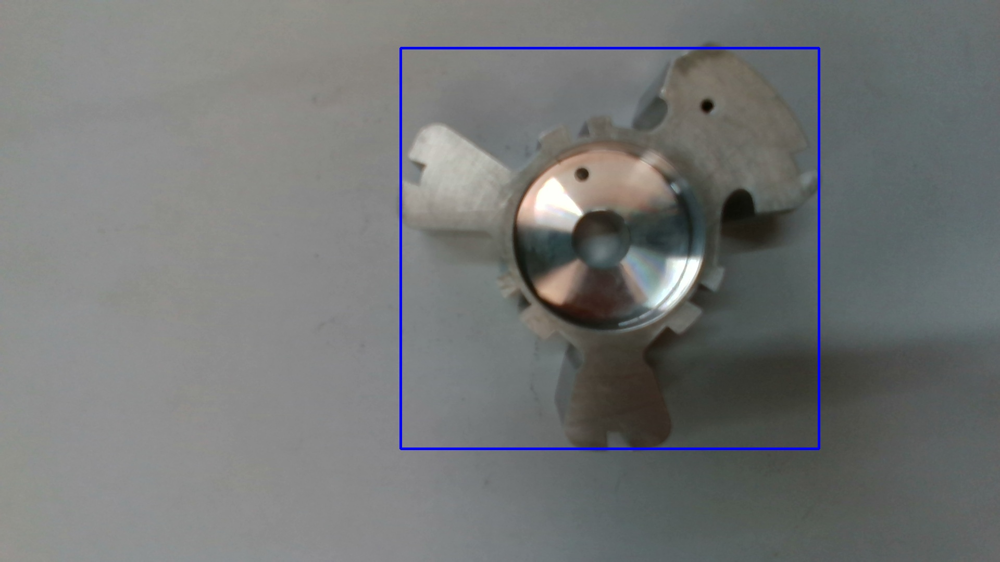
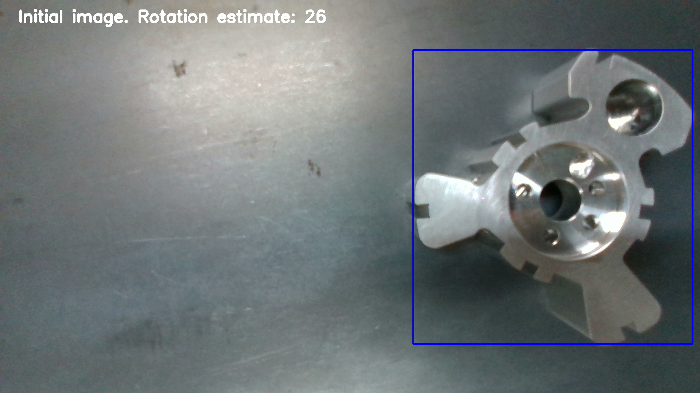
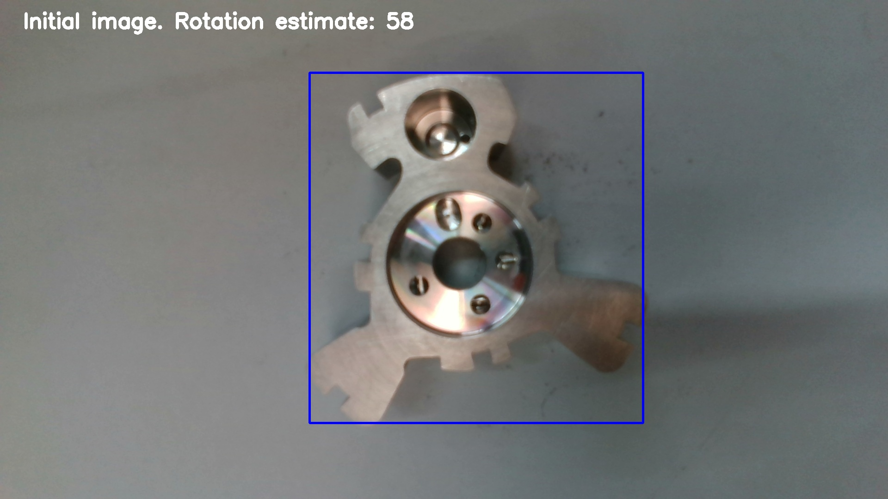
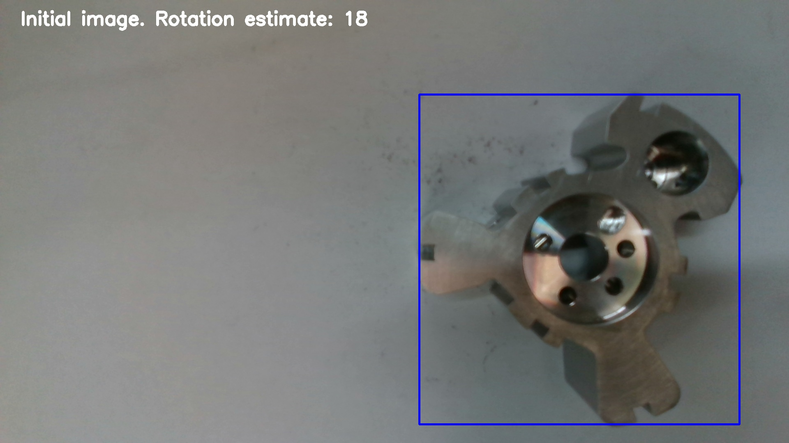
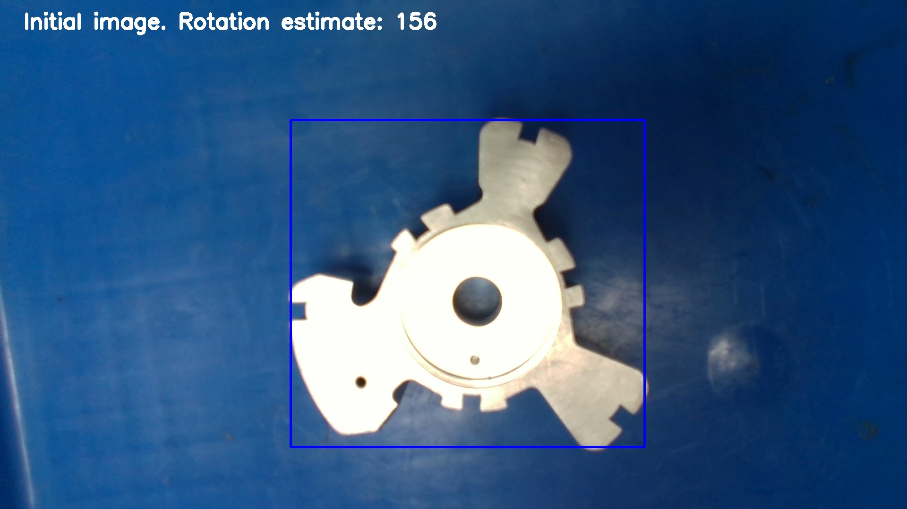

# About the mini-project:
This project was created as part of the application process for a Computer Vision role. The program consumes two image 
files from `images/` and attempts to find the rotation of the object between the two images in degrees.

**There is a Jupyter Notebook in this repository** which highlights all the inference and experimentation done while
creating this program. It's messy but conveys my thought process, and various attempts I made. It may not run in the
currently organized repository. Note that it is **slightly outdated**.

Additionally, two different methods for this algorithm have been implemented, and both can be experimented with by
modifying parameters in `main.py` (see below for more). A third method is identified for implementation, but has not
yet been implemented. Currently, the two methods are `keypoint analysis` and `circle analysis`.

That's all for now. Thanks, Puru, for this challenge!

## How to run the program:
*Note*: To understand the logic behind the program (and my thought process in creating it), I would recommend seeing
the `brainstorming.png` image found in the repository.

1) Use `pip install -r /path/to/requirements.txt` to install the necessary packages to run the program.
2) In `main.py`, change the constants under "FOR USER TO MODIFY" according to the instructions provided.
3) Run the program either using `python3 main.py` or using the Run configuration in your editor.
*Note: I would recommend running using the Command Prompt.*

This program was tested using **Python 3.9** on Linux. Minimal testing was conducted, so run the program at your own 
discretion.

**Important:** If you would like to create results from scratch, and overwrite `results/`, then you must delete the
local copy of the repository and set `GENERATE_ALL = True`. The program does not, by default, overwrite existing
results.

## Sample output image(s):
After running the program, here are sample results saved in `results/`. Note that rotation is measured anti-clockwise.

### Template Image:

### Sample Test Images:

#### Results using `keypoint analysis` method:

#### Results using `circle analysis` method:

## Organization of `results/`
All the results can be found in the `results/` directory of this repository. It has been categorized by method, and
subcategorized by the template image used.